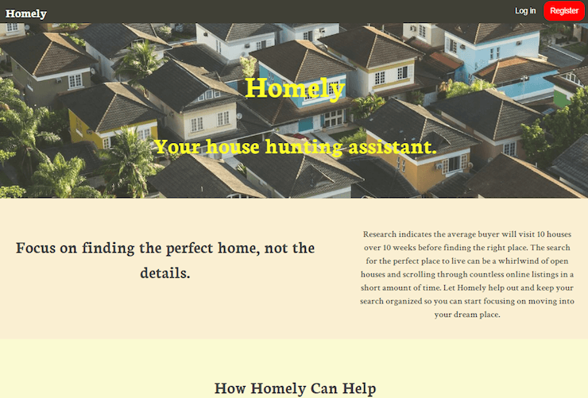
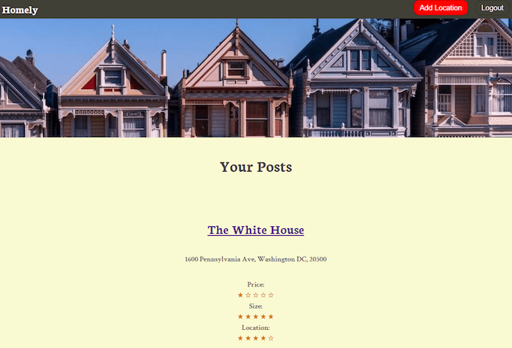
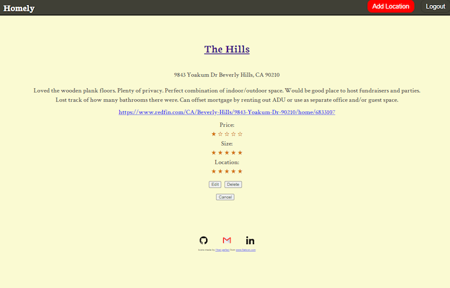
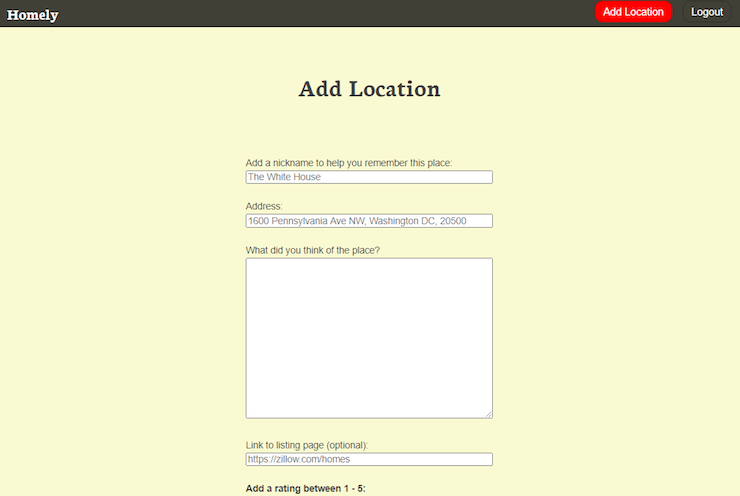

# Homely

## Summary

Research indicates the average buyer will visit 10 houses
over 10 weeks before finding the right place. Homely helps you keep track of all the houses and apartments
you've visited. Quickly create a post for each place, assign it an
alias as a handy reference, and make notes on your initial
impressions and potential renovation ideas before you visit the
next place and forget. Find out the description in the listing
doesn't match reality? Jot it down.

## Live Site

[Link](https://homely-app.vercel.app/) to view it in the browser.
[Link](https://github.com/rogtang/homely-app-api) to view the API.

Upon accessing the landing page for the first time, you are on the Public Route for the site and can navigate to the Login and Registration pages. To login as a test user, use username: demo@demo.com with password: password123 and you will be taken to the Private Route and the user Dashboard. NOTE: the Dashboard will only display that specific user's posts. To verify, you can logout and login with username: homelytest@homely.com with password: homely123 or register a new account.

## Screenshots

## Built With (Client-side):
- React.js
- JSX
- CSS
- Jest (Testing)
